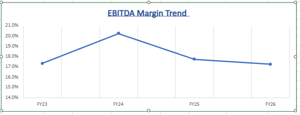
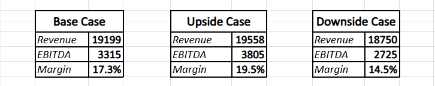

# FY26 Financial Forecast and Scenario Analysis  
## Britannia Industries | FP&A Project

---

## Project Overview

This project presents a driver-based Financial Planning and Analysis (FP&A) model developed using consolidated historical financial data from FY23 to FY25 to forecast FY26 performance for Britannia Industries.

The project reflects real-world corporate FP&A practices, focusing on margin analysis, cost drivers, and scenario-based financial planning.

---

## Project Objectives

- Analyze historical revenue and profitability trends  
- Identify key business and cost drivers  
- Build a driver-based financial forecast for FY26  
- Perform Base Case, Upside Case, and Downside Case scenario analysis  
- Create an executive-level financial dashboard  

---

## Historical Performance Insights (FY23–FY25)

- Revenue growth accelerated in FY25  
- EBITDA margin peaked in FY24 at approximately 19 percent  
- Margin pressure observed in FY25 due to cost inflation  
- Raw material cost, at approximately 60 percent of revenue, identified as the primary margin driver  

---

## EBITDA Margin Trend

Figure: Historical EBITDA margin trend showing margin expansion in FY24 and compression in FY25

---

## Key Financial Drivers Identified

### Revenue Drivers
- Volume growth  
- Pricing power  

### Cost Drivers
- Raw material inflation as the dominant margin risk  
- Advertising and promotion spend as a discretionary lever  
- Relatively stable employee cost structure  

---

## FY26 Forecast and Scenario Analysis

The model evaluates FY26 financial performance under three scenarios to assess profitability sensitivity and downside risk.

| Scenario   | EBITDA Margin (Approx.) |
|-----------|--------------------------|
| Base Case | ~17.0%                   |
| Upside    | ~19.5%                   |
| Downside  | ~14.5%                   |

### Key Insight

A one percentage point change in the raw material cost ratio has a material impact on EBITDA margin, highlighting strong sensitivity to commodity inflation.

---

## Scenario Analysis Snapshot

Figure: Scenario-based EBITDA margin outcomes driven primarily by raw material cost assumptions

---

## Tools and Techniques Used

- Microsoft Excel with structured financial modeling  
- Driver-based forecasting methodology  
- Scenario modeling using MATCH and CHOOSE functions  
- Margin sensitivity analysis  
- Executive-level dashboard design  

---

## Conclusion

- Raw material cost volatility represents the most critical profitability risk  
- Advertising spend can be tactically adjusted to partially protect margins  
- Scenario planning improves financial preparedness and management decision-making  
- The model demonstrates practical FP&A thinking aligned with corporate finance roles  

---

## Notes

- All financial data used is consolidated  
- This project is intended to be interview-ready for FP&A, corporate finance, and management consulting roles  
